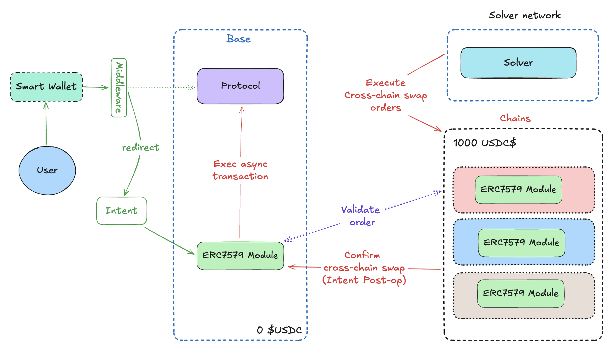

# MetaIntents

A module for smart wallets for default cross-chain transactions, utilizing multiple chains simultaneously.

[**View Demo**](#) | [**Slides**](https://docs.google.com/presentation/d/1exWiL3x_nM_RZHnsxRi7SxBX0pz1ihN_BkVOLXcGu8s/edit?usp=sharing) | [**Documentation**](https://github.com/Juminstock/eth-bangkok) 

---

# Table of Contents
- [About the Project](#about-the-project)
  - [Demo](#demo)
  - [How it Works](#how-it-works)
  - [Built With](#built-with)
- [Getting Started](#getting-started)
  - [Prerequisites](#prerequisites)
  - [Installation](#installation)
- [Contact](#contact)
  - [Team](#team)
- [License](#license)

---

## About the Project
This project enables the integration of a module into a smart wallet, allowing seamless cross-chain transactions by default. It leverages two or more chains simultaneously, ensuring transactions can be executed efficiently across different networks without user intervention, even when funds are insufficient on the originating chain.

### Demo
Check our demo here: [View Demo]()

### How it Works
We use Dynamic as our smart wallet provider, integrating it with a module created with LayerZero. 

When a user initiates a transaction on a chain where their wallet lacks sufficient funds, our module intervenes. It extracts the calldata from the original transaction, replicates it on other supported chains, and resolves the transaction using a Solver. 

The solver ensures the transaction is executed on-chain using LayerZero's cross-chain messaging capabilities, effectively bridging funds or resources between chains to complete the original transaction.

### Built With

**MetaIntents** is supported by the following sponsors:
- [Dynamic](https://dynamic.xyz/)
- [LayerZero](https://layerzero.network/)

---

## Getting Started

### Prerequisites
List any requirements or dependencies here.

### Installation
Provide step-by-step instructions to set up the project locally.

---

## Contact

### Team
- **Ariel Cardenas** - [Ariiellus](https://x.com/Ariiellus)
- **Carlos Rodriguez** - [Juminstock](https://x.com/Juminstock)
- **Sury Bonfil** - [holaNFT](https://x.com/holaNFT)
- **Anotherdev** - [0xAnotherdev](https://x.com/0xAnotherdev) 

---

## License
MIT License

Copyright (c) 2024 Carlos Rodríguez

Permission is hereby granted, free of charge, to any person obtaining a copy
of this software and associated documentation files (the "Software"), to deal
in the Software without restriction, including without limitation the rights
to use, copy, modify, merge, publish, distribute, sublicense, and/or sell
copies of the Software, and to permit persons to whom the Software is
furnished to do so, subject to the following conditions:

The above copyright notice and this permission notice shall be included in all
copies or substantial portions of the Software.

THE SOFTWARE IS PROVIDED "AS IS", WITHOUT WARRANTY OF ANY KIND, EXPRESS OR
IMPLIED, INCLUDING BUT NOT LIMITED TO THE WARRANTIES OF MERCHANTABILITY,
FITNESS FOR A PARTICULAR PURPOSE AND NONINFRINGEMENT. IN NO EVENT SHALL THE
AUTHORS OR COPYRIGHT HOLDERS BE LIABLE FOR ANY CLAIM, DAMAGES OR OTHER
LIABILITY, WHETHER IN AN ACTION OF CONTRACT, TORT OR OTHERWISE, ARISING FROM,
OUT OF OR IN CONNECTION WITH THE SOFTWARE OR THE USE OR OTHER DEALINGS IN THE
SOFTWARE.
